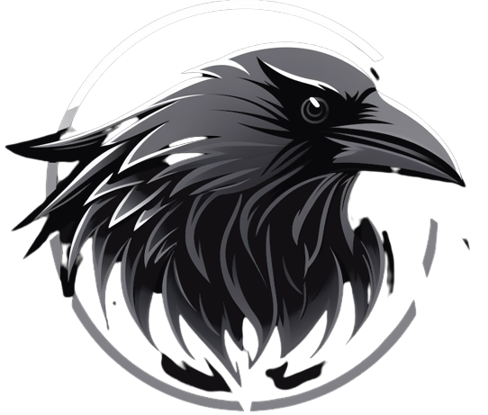

 <h1 align="center">
 Corvus 
 </h1>

   
  

  
   
   
   
 Corvus is a GTK theme with a dark color palette and elegant aesthetics. With a minimalist interface and carefully crafted details, the theme creates a sophisticated atmosphere. 

  

   
   
   
   
   

   
   
   
OBS: I would like you to take into account that this project is not ready yet and therefore many things can change. I intend to rewrite it from the beginning, as it is based on the Awesthetic theme.
